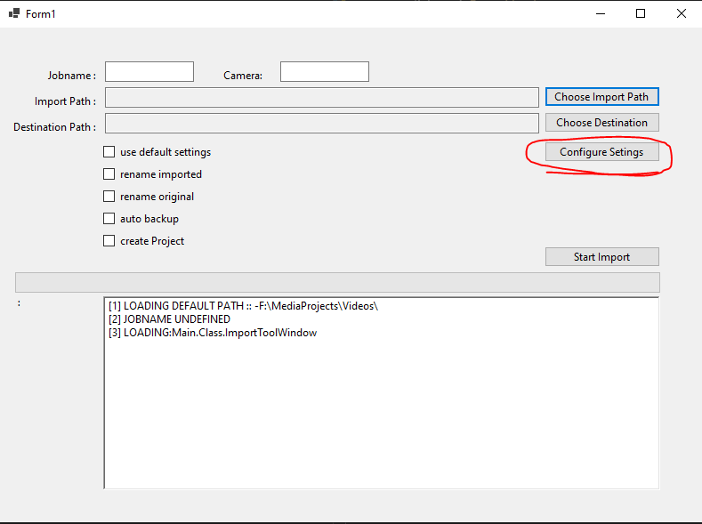
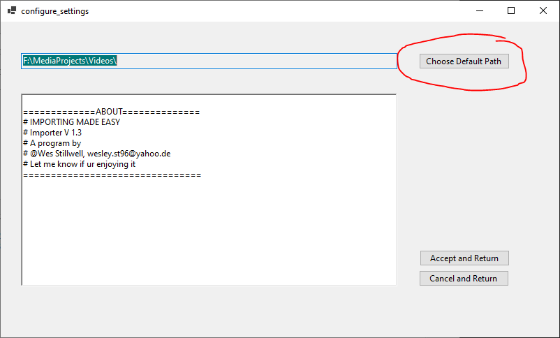

# WImporter

*a small easy import tool*

## Setup

To use the import tool you can either Clone the Repository, if you wish to build it yourself, or just the `Importtool_(version).zip`. This Tutorial will assume the ZIP has been downloaded.

1. Extract the Zip File To Prefered Location
2. Launch `Importtool.exe`
3. Configuring Default Import Path
   - *3.1* . Click Configure Settings 
   - *3.2* Click Choose default Path 
   - *3.3* Click Accept and Return to apply setting
4. Configure Premier Project
   - *4.1* Click Configure Settings again
   - *4.2* Next to *Default Premier Template*  click the Choose Default Path button
   - *4.3* Navigate to your Default Premeiere Projet you with to also copy 
   - *4.4* Click Accept and Return to apply setting
5. The Program has been set up
## Usage

Set your  `Jobname` to the name of the import job, this will be the name of the top-level folder. Set `Camera` to what Camera you are importing, eg: GOPRO, or Filmcamera1
### Quick Import

1. For a quick import click the checkmark `use default settings`
2. Press `Choose Import Path` to the selected Location you want to import
3. Press `Start Import` button and it will copy files to the configured default Path

### Custom Import

1. For a custom FImport make sure `use default settings` is unchecked.
2. Press `Choose Import Path` to the selected Location you want to import
3. Press `Choos Destination` to select where your files need to go
4. Tick `create Project` to copy the selected Premier file for workflow
4. Press `Start Import` button and it will copy files to the selected directory

## Notes

- Program needs to be restarted for fresh import (it will close after acceping complete import message anyway)
- To add a 2nd camera to the Import-Job just relaunch the Programm and enter the same Jobname

## Changes
### 1.3
   Introducing the main Program with basic functionality
### 1.4
   Improved Configure
   - Added ability to copy from Premiere Project

## About
IMPORTING MADE EASY

WImporter V 1.3

A program by 

@Wes Stillwell, wesley.st96@yahoo.de

Let me know if ur enjoying it

================================
